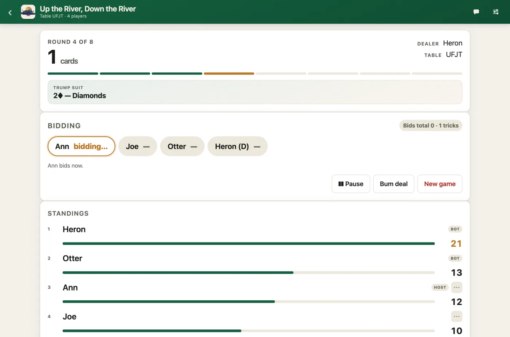
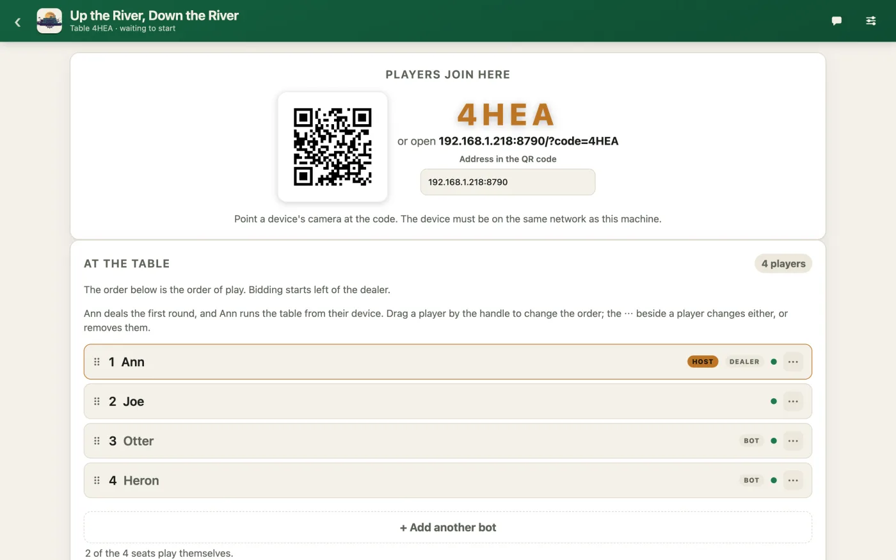
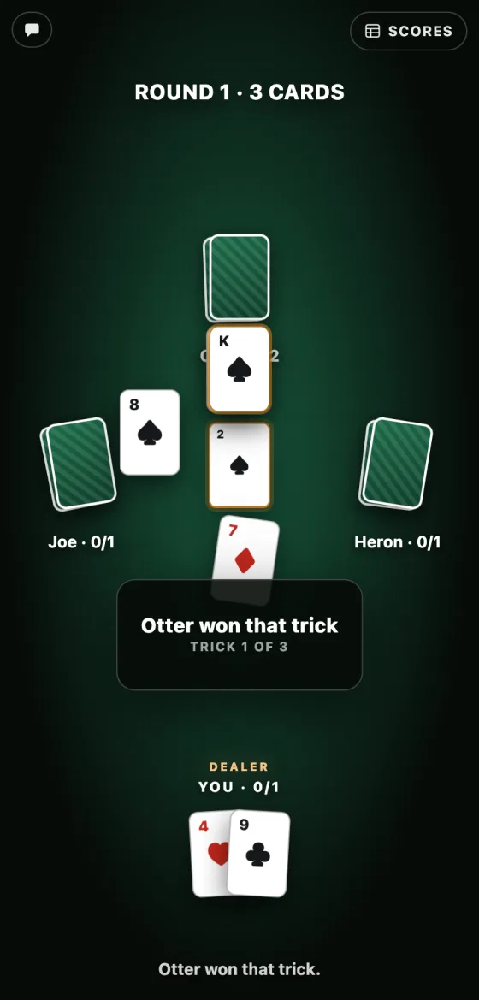
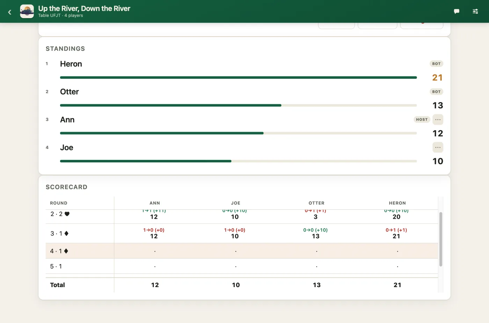
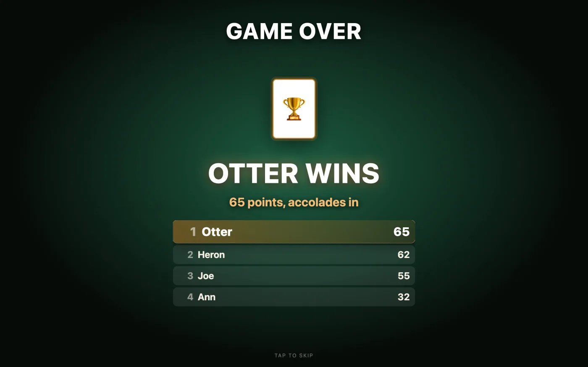
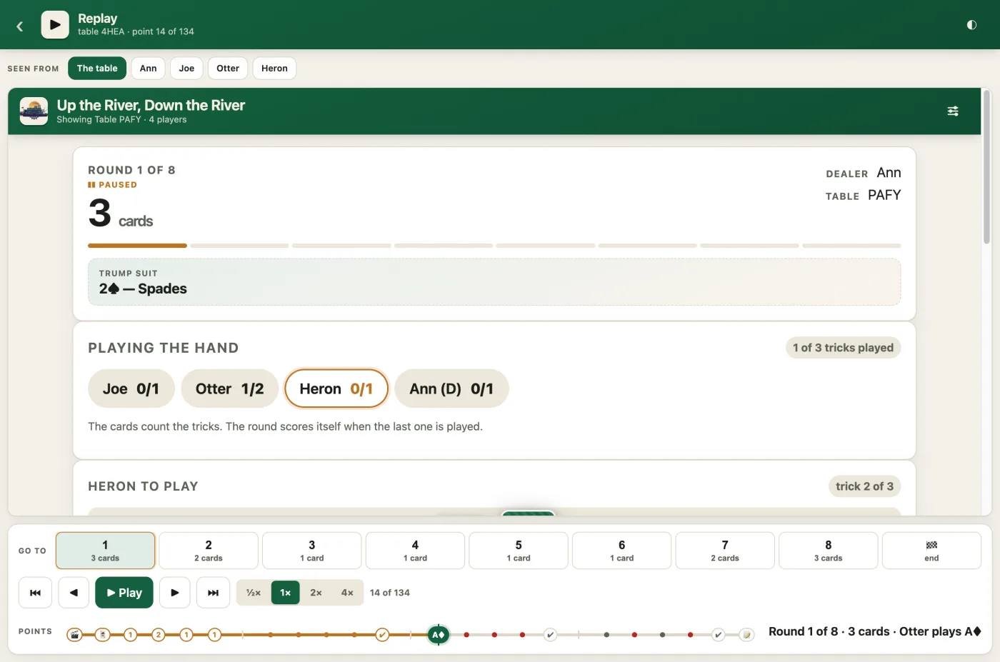
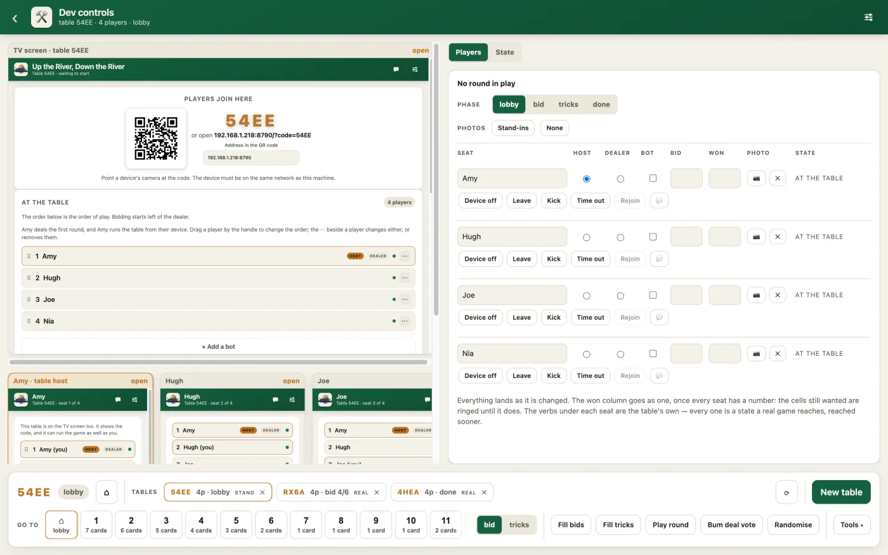

# Up the River, Down the River

> This is a completely vibe-coded app and game. A few mates and I were playing this card game and we ran out of paper for the scorecard. We figured it'd be faster to vibe-code a scorecard system for the game than to find paper, which worked out to be true at the time. I have not seen or reviewed the code generated. I make no guarantees of the quality or completeness of what was produced but a lot of time (and tokens) were spent in fleshing out features and fixing bugs.

### Interesting Claude stats

| | |
|---|---|
| **Working sessions** | 8 |
| **Active time** | 46.3 hours |
| **Prompts** | 381 |
| **Tokens** | 2.07 billion — 28.4 million of them new, the rest re-reading the conversation |

Over eight days, to 1 September 2026.


A score tracker for the betting card game — the one where you say how many tricks
you will take before you play the hand, and you are paid for being exactly right.

**One server, one screen on the wall, one device per player.** It keeps score
while you play with a real deck, or it deals a virtual deck to the devices and
plays the whole hand out.

**It never talks to the internet.** The pages, the fonts and the QR code all come
from the server, so a table works anywhere the devices can reach the machine
running it — a plane included.



---

## Start a table

```sh
npm install
npm start
```

The console prints the addresses:

- **TV screen** — `http://localhost:8787/host.html`
- **Players join** — `http://localhost:8787/`

Press **Start a table**, and the others scan the QR code. That is the whole of it.

The devices must be on the same network as the server. Set `PORT` to use a
different port.

> **One device is enough.** The first player to take a seat runs the table from
> their own phone — rules, seat order, start, undo, new game. A TV screen is
> optional.

---

## What it does

### A table anybody can join

A 4-character code and a QR code. Point a phone camera at it and you land on the
join page with the code filled in.



### Real cards, or cards on the devices

With **real cards** the app is a scorecard and a bid pad: you deal a real deck and
the dealer taps who took each trick.

With **virtual cards** the server deals, turns a card for trumps, and the round is
played on the felt. **A hand is a secret** — each device is sent its own cards and
nothing else — and the rules live on the server, so nobody can renege, play out of
turn, or play a card they do not hold.



### Bots for the empty seats

A hand short of people, the table provides players. They bid what a hand looks
worth, play to make the bid and duck once they have made it, and go through the
same rules as everybody else.

### A scorecard you can correct

Every round, every bid, every trick. **Tap a scored round and retype it** — the
tricks have to total the hand, so the check catches the slip.



### A finish worth watching

The places, then the accolades drawn and paid in one at a time, then the winner —
**which is not always whoever led before them**.



### A game you can watch again

Every table writes down what happened as it happens. A past game replays on a copy
of itself — the rounds, a point-by-point timeline, and **whose screen you watch it
from**.



### And when something goes wrong

`/dev.html` is every screen at once, live, side by side. It also opens on a **real**
table from the TV screen's ⚙, where it offers only the two controls that put a game
right and invent nothing.



---

## Also

- **A table outlives the server it is on.** It is written to disk after every
  change and read back when the server comes up.
- **A device that goes quiet is waited for**, and there are three ways back to the
  seat. One that is not coming back can be handed to auto-play.
- **Seven sets of colours**, light and dark, chosen per screen.
- **Table talk** — a chat room per table, kept in memory and never written down.
- **An Android app** that carries the server inside it, so one phone hosts and
  plays and everybody else joins with a browser.
- **Docker images** for `amd64` and `arm64`, so a Raspberry Pi runs the same table.

---

## Documentation

| | |
|---|---|
| **[The wiki](https://github.com/chrisjtwomey/up-and-down-the-river/wiki)** | How to play, how to set a game up, and every feature in full. |
| **[The card game](https://github.com/chrisjtwomey/up-and-down-the-river/wiki/The-card-game)** | The rules — bidding, screw the dealer, and the scoring. |
| **[Hosting a table](https://github.com/chrisjtwomey/up-and-down-the-river/wiki/Hosting-a-table)** | A laptop, a phone, Docker, a reverse proxy, and a table with no internet at all. |
| **[Troubleshooting](https://github.com/chrisjtwomey/up-and-down-the-river/wiki/Troubleshooting)** | The socket will not connect, the QR code says `localhost`, the screen sleeps. |
| **[CONTRIBUTING.md](CONTRIBUTING.md)** | Running it, testing it, the architecture, and the code style. |

---

## Working on it

```sh
npm run dev     # live reload on 8787
npm test        # three suites, about twenty seconds
```

No build step, no bundler, no framework — every file is a plain script. See
**[CONTRIBUTING.md](CONTRIBUTING.md)** before changing anything.

---

## Notes

- **There is no account system.** Anyone with the code and network access can take
  a seat, so use it on a network you trust.
- Devices only keep their screens awake on a secure page. `npm run cert` writes a
  self-signed certificate for this machine.
